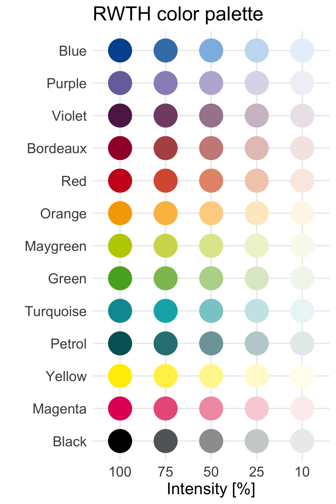

# RWTHColorPalette

## Overview
This package provides R-code to query colors from [RWTH corporate design](http://www9.rwth-aachen.de/global/show_document.asp?id=aaaaaaaaaadpbhq)

## Installation
```r
# install the development version from GitHub
# install.packages("devtools")
devtools::install_github("christianholland/RWTHColorPalette")
```

## Usage
The color palette contains 13 different colors, each in 5 different intensities (100%, 75%, 50%, 25% and 10%). Query colors by combining color name in lower case (check figure below for color names) and color intensity. For colors with 100% intensity the color name alone is sufficient.
```r
# load package
library(RWTHColorPalette)

# show the color palette
display_rwth_color()

# query single or multiple colors
rwth_color("blue")
[1] "#00549F"

rwth_color(c("green", "green75", "green50", "green25", "green10"))
[1] "#57AB27" "#8DC060" "#B8D698" "#DDEBCE" "#F2F7EC"
```

## Color Palette

