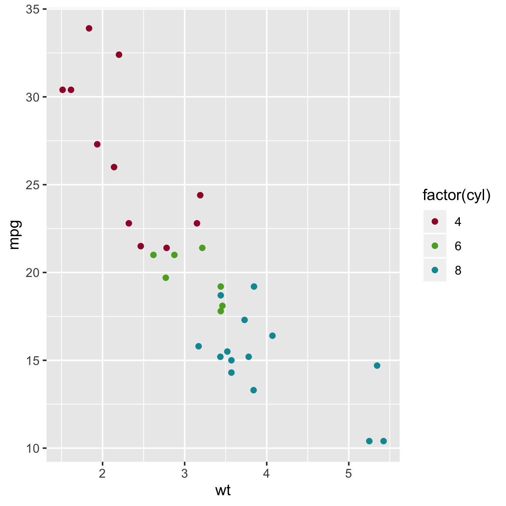

# AachenColorPalette
[](https://travis-ci.com/christianholland/AachenColorPalette)
[](https://codecov.io/gh/christianholland/AachenColorPalette)


## Overview
This package allows to query colors from a palette inspired from [RWTH corporate design](http://www9.rwth-aachen.de/global/show_document.asp?id=aaaaaaaaaadpbhq) using R. The color palette contains 13 different colors, each in 5 different intensities (100%, 75%, 50%, 25% and 10%; see figure below). 

## Disclaimer
The color palette makes no claim to completeness or correctness of the official RWTH corporate design.

## Installation
```r
# install the development version from GitHub
# install.packages("devtools")
devtools::install_github("christianholland/AachenColorPalette")
```

## Usage
Query colors by combining color name in lower case (check figure below for color names) and color intensity. For colors with 100% intensity the color name alone is sufficient.
```r
# load package
library(AachenColorPalette)

# show the color palette
display_aachen_color()

# query single or multiple colors
aachen_color("blue")
[1] "#00549F"

aachen_color(c("green", "green75", "green50", "green25", "green10"))
[1] "#57AB27" "#8DC060" "#B8D698" "#DDEBCE" "#F2F7EC"
```

## Color Palette


## Example
```r
library(ggplot2)
library(AachenColorPalette)

ggplot(mtcars, aes(x = wt, y = mpg, color=factor(cyl))) +
  geom_point() +
  scale_color_manual(values = aachen_color(c("bordeaux", "green", "turquoise")))
```

